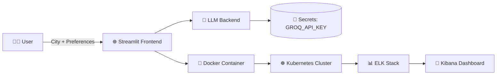

# ✈️ AI Trip Planner

> **AI Trip Planner** is a next-generation LLM-powered travel assistant that transforms how users design and experience trips. By combining Large Language Models with a sleek Streamlit UI, it generates personalized, day-by-day itineraries enriched with images, maps, and activity details.

  
  
  

---

## 🚀 Features

- 🌍 **Intelligent trip planner** powered by LLMs  
- 🖥️ **Streamlit app** with multiple itinerary views (overview, table, gallery, maps)  
- 📦 **Dockerized build** for consistent environments  
- ☸️ **Kubernetes manifests** for deployment at scale  
- 🔑 **Secure API key handling** with Kubernetes Secrets  
- 📊 **Monitoring & observability** using Elasticsearch, Logstash, Kibana & Filebeat (ELK)  
- ☁️ **Cloud-ready** with Google Cloud VM integration  

---

## 📸 Demo

### 🗓️ Daily Itinerary Overview


### 🖼️ Points of Interest Gallery


### 📊 Table View of Itinerary


---

## 🏗️ Architecture



---

## 📂 Project Structure

```
AI-Trip-Planner/
├── app.py                  # Streamlit app
├── requirements.txt        # Python dependencies
├── Dockerfile              # Docker build
├── k8s-deployment.yaml     # Kubernetes deployment
├── llmops-k8s.yaml         # Extended LLMOps config
├── elasticsearch.yaml      # ELK configs
├── kibana.yaml
├── logstash.yaml
├── filebeat.yaml
├── assets/                 # Screenshots & demo images
├── .gitignore
├── LICENSE
└── README.md
```

---

## ⚡ Quick Start

### Local Setup
```bash
git clone https://github.com/ridabayi/AI-Trip-Planner.git
cd AI-Trip-Planner
python -m venv venv && source venv/bin/activate
pip install -r requirements.txt
streamlit run app.py
```

### Docker
```bash
docker build -t trip-planner:latest .
docker run -p 8501:8501 trip-planner:latest
```

### Kubernetes
```bash
eval $(minikube docker-env)
docker build -t trip-planner:latest .

kubectl create secret generic llmops-secrets   --from-literal=GROQ_API_KEY="your_api_key_here"

kubectl apply -f k8s-deployment.yaml
kubectl get pods
kubectl port-forward svc/streamlit-service 8501:80 --address 0.0.0.0
```

### Logging (ELK Stack)
```bash
kubectl create namespace logging
kubectl apply -f elasticsearch.yaml -n logging
kubectl apply -f kibana.yaml -n logging
kubectl apply -f logstash.yaml -n logging
kubectl apply -f filebeat.yaml -n logging
```

---

## ☁️ Google Cloud VM Setup

- **OS:** Ubuntu 24.04 LTS  
- **Machine type:** e2-standard (16 GB RAM, 256 GB Disk)  
- **Networking:** HTTP/HTTPS enabled  
- **Installed:** Docker, Minikube, kubectl  

---

## 📌 Roadmap

- [ ] CI/CD with GitHub Actions  
- [ ] HashiCorp Vault integration for secrets  
- [ ] Prometheus + Grafana metrics monitoring  
- [ ] Multi-cloud deployment support  

---

## 🤝 Contributing

Contributions are welcome!  
1. Fork the repo  
2. Create a branch (`git checkout -b feature/my-feature`)  
3. Commit (`git commit -m "Add feature"`)  
4. Push (`git push origin feature/my-feature`)  
5. Open a Pull Request 🚀  

---

## 📜 License

Released under the **MIT License**. See [LICENSE](LICENSE) for details.  

---

## 👤 Author

**Rida Bayi**  
🔗 [GitHub](https://github.com/ridabayi) | [LinkedIn](https://www.linkedin.com/in/rida-bayi/)  

---
